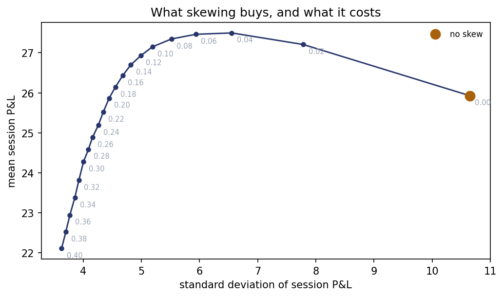
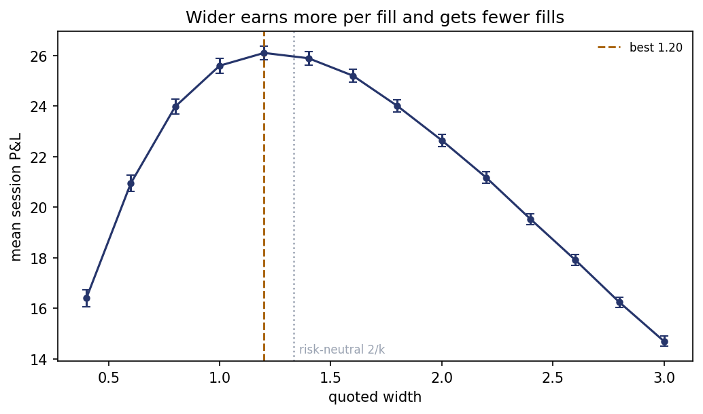

# Can you make money quoting both sides?

A market maker posts a bid and an ask at the same time and earns the difference,
with no view on which way the price goes. This simulates one doing that for
6,000 sessions and measures the three things that stop it being free money.

**Headline:** quote skewing is not the risk/return tradeoff it is usually
described as. At the optimum it **raises** mean session P&L by 6% *and* cuts its
standard deviation by 38%, leaving the unskewed policy strictly dominated. Of
four predictions made by the standard analytical solution, one survives.



---

## The question

Posting a bid at 99.95 and an ask at 100.05 earns ten cents every time one buyer
and one seller turn up. No forecast is needed. Three things break that:

- **Inventory.** Flow does not arrive politely alternating. Five sellers in a row
  leave you holding a position you never wanted, and its risk is unbounded while
  your edge per trade is fixed.
- **Adverse selection.** Some of the people trading with you know the price is
  about to move. Your fills are then selected against you.
- **The tradeoff.** A wider quote earns more per fill and gets fewer fills.

The counter to the first is **skewing**: when long, slide *both* quotes down, so
the ask is likelier to be lifted and the bid likelier to be left alone. The width
does not change — only the centre moves.

## What is assumed, and what is measured

This is a simulation, so the assumptions are the project's weak point and are
stated first rather than buried.

| assumed | value | why |
|---|---|---|
| mid follows a driftless random walk | σ = 2.0 per session | 2% on a mid of 100, a normal day for a liquid single name |
| arrivals are Poisson, intensity `A·exp(−k·δ)` | A = 60, k = 1.5 | fill rate halves every 0.46 in price |
| informed trades move the mid | impact = 0.5 | a quarter of a session's volatility |
| risk preference | γ = 0.02 on variance | a session σ of 10 costs about 1, ~4% of a typical mean |

Everything else is measured. The exponential arrival intensity is the standard
choice because it is tractable, **not** because it was fitted to order-book data.
Section 4 of the output re-runs every conclusion at half and double each of the
four parameters; a conclusion that flips under a factor of two is not reported as
a conclusion.

## The book-keeping test

Every simulated trading system can be checked against an identity that must hold
exactly, whatever the parameters:

```
cash + q · mid  ≡  (spread captured)  +  (inventory P&L)
```

This is asserted at **every step of every path**, not at the end. A final number
always looks plausible; an identity that has to hold 500 times a session does
not, and when it breaks it names the step. Building it first made everything
downstream faster. Six further self-tests run with no data: a frozen price where
P&L must equal spread minus close-out cost exactly, a zero-width quote that must
earn exactly nothing, and a realised fill rate that must match `A·exp(−k·δ)`.

## 1 · How wide should you quote?

Risk-neutral theory says the best half-spread is `1/k`, since `d/dδ[δ·e^(−kδ)]`
vanishes at `δ = 1/k` — so a total width of **1.333** here.

| width | mean | se | std | 5th pct |
|---|---|---|---|---|
| 0.80 | 23.98 | 0.15 | 11.52 | 5.31 |
| 1.00 | 25.60 | 0.14 | 11.16 | 7.17 |
| **1.20** | **26.11** | 0.14 | 10.77 | 8.40 |
| 1.40 | 25.90 | 0.13 | 10.30 | 9.10 |
| 1.60 | 25.21 | 0.13 | 9.82 | 8.91 |
| 2.00 | 22.65 | 0.12 | 9.13 | 7.09 |

The optimum lands at 1.20, slightly **below** the risk-neutral 1.333 rather than
above it. Closing the book crosses the spread, so a wider quote also makes the
end-of-session clean-up dearer, and that pulls against the usual inventory
argument for widening.

It should be read as a plateau, not a point: 1.20 beats 1.40 by 0.11 against a
standard error of 0.14, so anything between roughly 1.0 and 1.6 is the same
answer.



## 2 · Skewing is not a tradeoff

The expectation going in was that skewing must cost mean P&L — you are
deliberately accepting worse prices — and buy risk reduction with it. That is not
what happens.

| skew | mean | Δ mean (paired) | std | 5th pct | mean \|q\| at close |
|---|---|---|---|---|---|
| 0.00 | 25.93 | — | 10.65 | 7.89 | 5.4 |
| 0.02 | 27.21 | +1.28 ± 0.06 | 7.79 | 14.42 | 3.1 |
| **0.04** | **27.50** | **+1.57 ± 0.09** | 6.55 | 16.92 | 2.2 |
| 0.06 | 27.46 | +1.54 ± 0.10 | 5.94 | 17.95 | 1.8 |
| 0.10 | 27.15 | +1.22 ± 0.11 | 5.19 | 18.83 | 1.4 |
| 0.20 | 25.87 | −0.06 ± 0.12 | 4.45 | 18.83 | 1.0 |
| 0.40 | 22.11 | −3.81 ± 0.13 | 3.63 | 16.19 | 0.7 |

Up to a skew of about 0.18, it is free: mean rises *and* variance falls, so the
unskewed policy is strictly dominated — it sits inside the frontier rather than
on it. Two reasons, both real rather than artefacts:

- **Closing out costs `width/2` per unit,** and skewing ends the session near
  flat. Mean inventory at the close falls from 5.4 to 2.2.
- **Arrival intensity is convex in distance.** Moving one quote nearer the mid
  and the other further by the same amount *raises* the total fill rate, since
  `e^(−k(δ−s)) + e^(−k(δ+s)) = 2e^(−kδ)cosh(ks) > 2e^(−kδ)`.

The genuine tradeoff only begins above 0.18, where the skew is large enough to
drag quotes far from the mid.

Differences are measured **paired**, path against path. Both runs use the same
price-path seed, so differencing removes almost all the noise two independent
standard errors would leave — which is what makes a 6% effect measurable at all.

## 3 · Four predictions, one survivor

Avellaneda & Stoikov (2008) solve this analytically for a maker with inventory
aversion γ: the quote centre is `mid − q·γ·σ²·(T−t)` and the width contains no
`q` at all. Four claims follow, each testable. They are scored on the
risk-adjusted objective, because a risk-neutral operator would not skew for risk
reasons at all and the mean alone cannot test a claim about risk.

| prediction | result | verdict |
|---|---|---|
| skew is **linear** in inventory | powers 1.5 and 2.0 lose by 0.16 ± 0.03 and 0.70 ± 0.04; power 0 (a flat shift) loses by 0.26 ± 0.03; power 0.5 is indistinguishable (−0.03 ± 0.02) | **survives** — though linear and square-root cannot be separated |
| skew scales with **σ²** | doubling σ doubles the best skew, 0.04 → 0.08. A 4× response was available on the grid and lost | **not reproduced** — scales with σ |
| skew **fades** as the session ends | fading loses to constant by 0.63 ± 0.03, each at its own optimum | **not reproduced** |
| width is **independent of inventory** | best width drifts 1.30 → 1.50 → 1.70 as skew rises | **not reproduced** |

Three failures are a statement about *this model*, not about the theorem. This
simulation differs from Avellaneda–Stoikov in ways that plausibly account for all
three: it charges a terminal liquidation cost that crosses the spread where they
have none, it penalises the variance of terminal P&L rather than using an
exponential utility throughout, and the skew grid is quantised at 0.04. Testing
which of those three is responsible is the obvious next piece of work.

## 4 · Adverse selection

Informed orders lift the ask just before the mid rises. Sweeping how *many* of
them there are, at the assumed impact of 0.5:

| informed | mean | spread income | inventory P&L |
|---|---|---|---|
| 0% | 27.47 | 28.57 | +0.01 |
| 25% | 24.92 | 28.57 | −2.54 |
| 50% | 20.97 | 28.57 | −6.49 |
| 100% | 14.26 | 28.57 | −13.20 |

**Spread income is completely untouched** — informed traders pay the same spread
as anybody else. Every penny of the damage is in the inventory column, and it is
linear at −13.2 per unit of informed fraction. At this impact, even 100% informed
flow does not kill the business.

So the number of informed traders is not the binding constraint; how much they
know is. Sweeping the impact with every order informed, market making breaks even
at an impact of **1.04 — 52% of a session's volatility per informed trade.**

Widening is the defence, and the model produces it unprompted: the best width
rises from 1.20 at no informed flow to 1.80 at 100%. That is what "the market
went wide" means in a crisis.

## 5 · Sensitivity

Every conclusion above depends on four numbers that were chosen rather than
measured. Halving and doubling each:

| variant | best width | best skew | std cut by skew | skewing still helps? |
|---|---|---|---|---|
| as specified | 1.20 | 0.060 | −45.1% | yes |
| A ×0.5 / ×2 | 1.20 / 1.20 | 0.080 / 0.040 | −39.8% / −49.2% | yes / yes |
| k ×0.5 / ×2 | 2.40 / 0.60 | 0.100 / 0.040 | −30.4% / −57.0% | yes / yes |
| σ ×0.5 / ×2 | 1.20 / 1.40 | 0.060 / 0.080 | −32.0% / −53.5% | yes / yes |
| impact ×0.5 / ×2 | 1.40 / 1.80 | 0.080 / 0.120 | −46.9% / −54.2% | yes / yes |

Skewing helps in all nine variants, so that conclusion is robust. The optimal
*width* is not: it moves by a factor of four with `k`, exactly as `2/k` predicts,
which means the specific number 1.20 is a property of the assumed order book and
should not be quoted as though it were a fact about markets.

## Limitations

- **The fill model was not fitted to anything.** Exponential arrival intensity is
  the standard assumption because it is tractable. Without real order-book data
  there is no way to check it, and the sensitivity table is the whole of the
  defence.
- **Simulated P&L is not evidence about real markets.** It is evidence about a
  mechanism. The mechanism is the point.
- **One unit per fill, no queue, no ticks.** Real order books have discrete
  prices, queue position and partial fills, all of which matter.
- **The mid is exogenous.** The maker's own quotes do not move it, which is false
  for anyone quoting size.
- **A single session.** No overnight risk, no capital constraint, no requirement
  to keep quoting when it stops paying.

## What I would do next

1. **Find which of the three differences from Avellaneda–Stoikov breaks their
   predictions** — the liquidation cost, the objective, or the grid. Removing the
   terminal cost is the cheapest test and I would start there.
2. **Replace the exponential intensity with a power law** and see which
   conclusions survive a different decay shape.
3. **Add queue position**, so that quoting at the same price as everybody else
   does not fill at the same rate as being alone.
4. **Let the maker's own trades move the mid**, which turns the inventory problem
   into an execution problem.

## Running it

```bash
pip install numpy matplotlib
python MarketMaking.py
```

Self-tests run first and need no data or network — if they pass, the book-keeping
is right and anything later is a result rather than a bug. The full run takes
about four minutes: 6,000 paths × 500 steps per measurement, and roughly 200
measurements across the sweeps. Everything is seeded, so the numbers above
reproduce exactly.

| file | |
|---|---|
| `MarketMaking.py` | self-tests, simulation, four experiments, figures |

## Prior work

Avellaneda & Stoikov (2008), *High-frequency trading in a limit order book*,
Quantitative Finance — the source of the four predictions in section 3.
Glosten & Milgrom (1985), *Bid, ask and transaction prices in a specialist
market* — where adverse selection was first modelled properly, and the origin of
the idea in section 4 that the spread exists to price informed flow.
